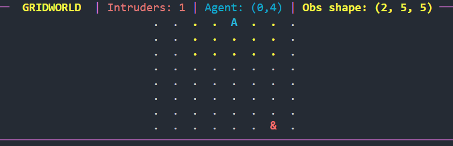

# Патрулирование

## Установка

1. Установите [uv](https://docs.astral.sh/uv/).
2. Перейдите в корень репозитория
3. Выполните:

```bash
uv sync
```

## GridWorld

### Обучение агента

1. Перейдите в корень репозитория
2. Выполните:

```bash
uv run services/patrol_planning/learning/train/train.py
```

После выполнения в директории `services/patrol_planning/learning/models/` появится файл `ppo_gridworld_agent_1.zip`.

### Тест с ботами

1. Перейдите в корень репозитория
2. Выполните:

```bash
uv run services/patrol_planning/learning/test/test_with_bots.py
```

### Интерактивный тест

1. Перейдите в корень репозитория
2. Выполните:

```bash
uv run services/patrol_planning/learning/test/test_with_input.py
```

Для управления нарушителем используйте клавиши:

- `W` - вверх
- `S` - вниз
- `A` - влево
- `D` - вправо
- `ESC` - выход

<figure style="text-align: center;">
  
  <figcaption>Так выглядит графическое представление среды в терминале</figcaption>
</figure>

## Pydantic Модели

### `GridWorldTrainState`

[`services/patrol_planning/service/models.py`](../service/models.py)

Состояние обучения GridWorld. Хранит параметры среды, агента и статистику эпизодов:

- `agent_pos`, `goal_pos` — позиции агента и цели
- `trajectory` — путь агента
- `step`, `episode` — счетчики шагов и эпизодов
- `total_reward`, `last_episode_reward` — накопленные награды
- `collision_count`, `goal_count` — статистика столкновений и достижения целей (не используются)
- `i_count` — число не пойманных нарушителей
- `landmark_pos` — позиции препятствий
- `terrain_map` — карта рельефа (не используется)
- `obs_raw` — данные наблюдения агента
- `is_collision` — флаг столкновения
- `new_episode` — флаг начала нового эпизода
- `running` — флаг выполнения обучения
- `mode` — режим работы

Метод `reset_counters()` сбрасывает все счетчики и статистику для нового эпизода.

### Пример сериализации в JSON

```jsonc
{
    "agent_pos": [[0.0, 0.0]], // [[float, float]], позиция агента [[x, y]]
    "goal_pos": [[0.0, 0.0]], // [[float, float]], позиции нарушителей [[x, y]]
    "trajectory": [], // [[float, float]], путь агента
    "step": 0, // int, счетчик шагов внутри эпизода (default: 0)
    "total_reward": 0.0, // float, накопленная награда за эпизод (default: 0.0)
    "episode": 0, // int, номер текущего эпизода (default: 0)
    "last_episode_reward": 0.0, // float, награда за предыдущий эпизод (default: 0.0)
    "new_episode": false, // bool, флаг начала нового эпизода (default: false)
    "i_count": 1, // int, число не пойманных нарушителей (default: 1)
    "obs_raw": null, // np.ndarray  | null, данные наблюдения агента

    // Параметры, не обновляемые/не используемые средой (оставлены для совместимости)

    "running": false, // bool, флаг выполнения обучения (default: false)
    "mode": "trail", // string, режим работы (default: "trail")
    "landmark_pos": [], // [[float, float]], позиции препятствий
    "is_collision": false, // bool, флаг столкновения (default: false)
    "goal_count": 0, // int, число достижений цели за эпизод
    "collision_count": 0, // int, число столкновений за эпизод
    "terrain_map": null, // [[float,...], ...] | null, карта рельефа 0..1
}
```

### `GridWorldConfig`

[`services/patrol_planning/assets/envs/models.py`](../assets/envs/models.py)

Конфигурация среды GridWorld:

- `agent_config` — конфигурация агента
- `intruder_config` — список конфигураций нарушителей
- `obs_config` — конфигурация наблюдения
- `max_steps` — длина эпизода
- `grid_size` — размер сетки

### Пример сериализации в JSON

```jsonc
{
    "agent_config": {
        "type": "default", // string, тип агента (default)
        "pos": [4, 4], // [int, int], позиция агента
        "is_random_spawned": false, // bool, случайное появление при сбросе (default: false)
        "m_block": 1.0, // float, штраф за блокировку
        "m_out": 1.0, // float, штраф за выход за границы
        "m_stay": 0.0, // float, штраф за бездействие
    },

    "intruder_config": [
        {
            "type": "poacher", // string, тип нарушителя
            "pos": [2, 2], // [int, int], позиция
            "is_random_spawned": true, // bool, случайное размещение при reset()
            "catch_reward": 1.0, // float, награда за поимку
            "m_plan": 100.0, // float, план нанесения ущерба
        },
    ],

    "obs_config": {
        "type": "box", // string, тип наблюдения
        "size": 4, // int, радиус наблюдения
        "layers_count": 2, // int, число каналов наблюдения
    },

    "max_steps": 150, // int, длина эпизода
    "grid_size": 8, // int, размер сетки
}
```

### Нарушители (Intruders)

<!-- #### `IntruderConfig` (базовый) -->

[`services/patrol_planning/assets/intruders/models.py`](../assets/intruders/models.py)

<!-- Базовый конфиг для нарушителей:

- `pos` — позиция
- `is_random_spawned` — случайный спавн при reset()
- `catch_reward` — награда за поимку

#### `ControllableConfig(IntruderConfig)`

Управляемый нарушитель (управляется с клавиатуры).

#### `WandererConfig(IntruderConfig)`

Блуждающий нарушитель (движется случайно). -->

### Наблюдения (Observations)

#### `ObservationConfig` (базовый)

[`services/patrol_planning/assets/observations/models.py`](../assets/observations/models.py)

Базовая конфигурация области наблюдения:

- `size` — размер области (по умолчанию 3)

#### `ObsBoxConfig`

Конфигурация наблюдения:

- `layers_count` — число слоёв (по умолчанию 2)
